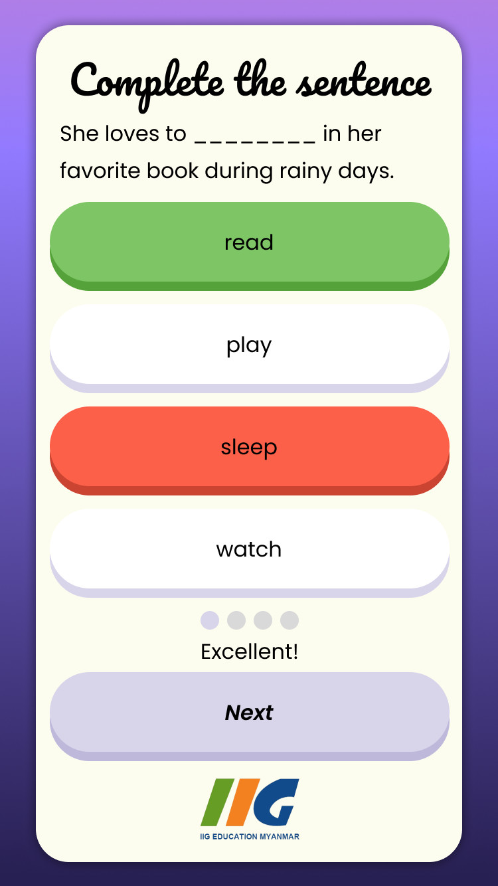
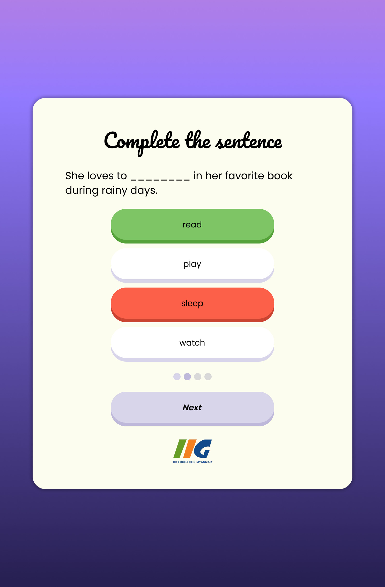
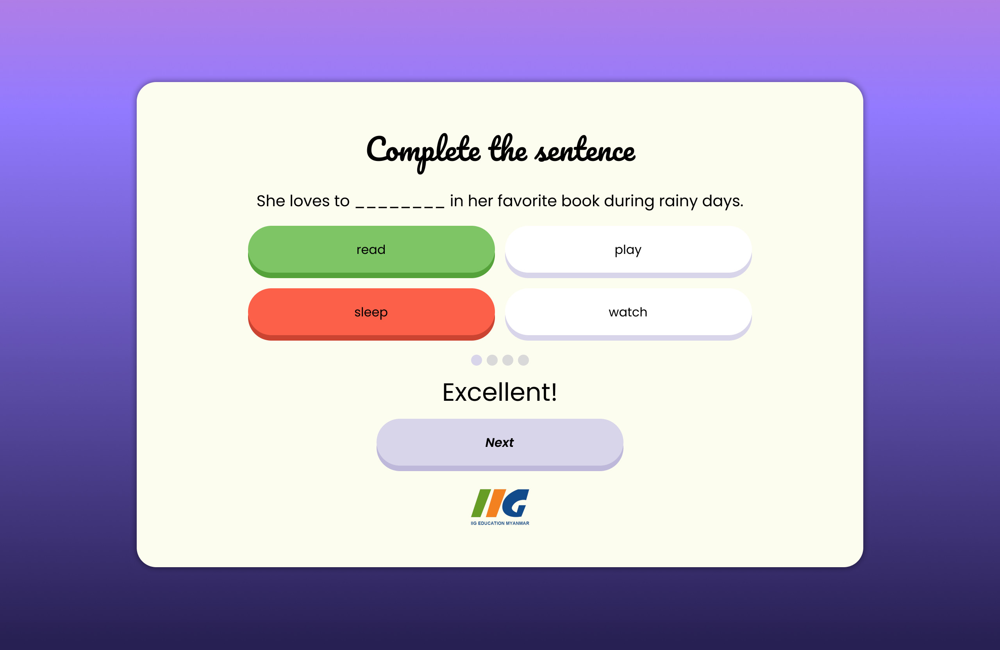

# quizzes-for-kids
A small project to demonstrate a quiz application for my client, "IIG Myanmar". The quiz will display a random question with multiple choice answers. It features a simple HTML and CSS layout, with JavaScript handling the main functionality and data stored in JSON format. The design is fully responsive as follows:

### Mobile Layout

### Tablet Layout

### Computer Layout

